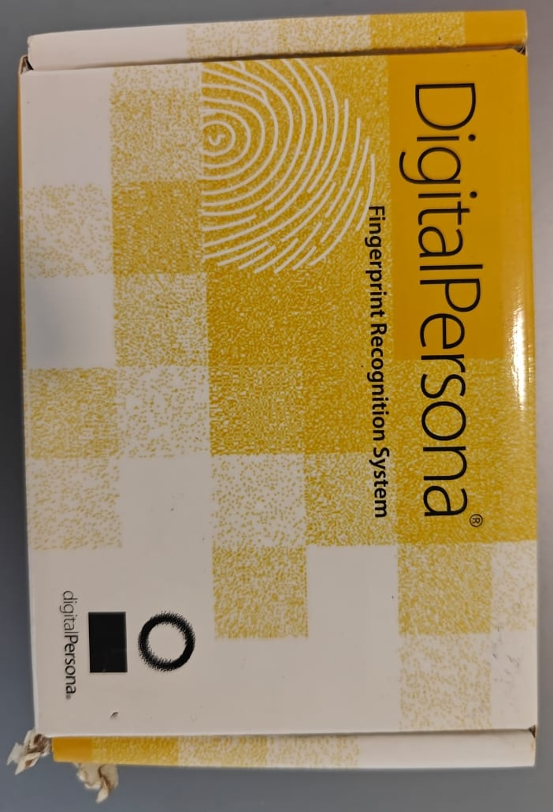
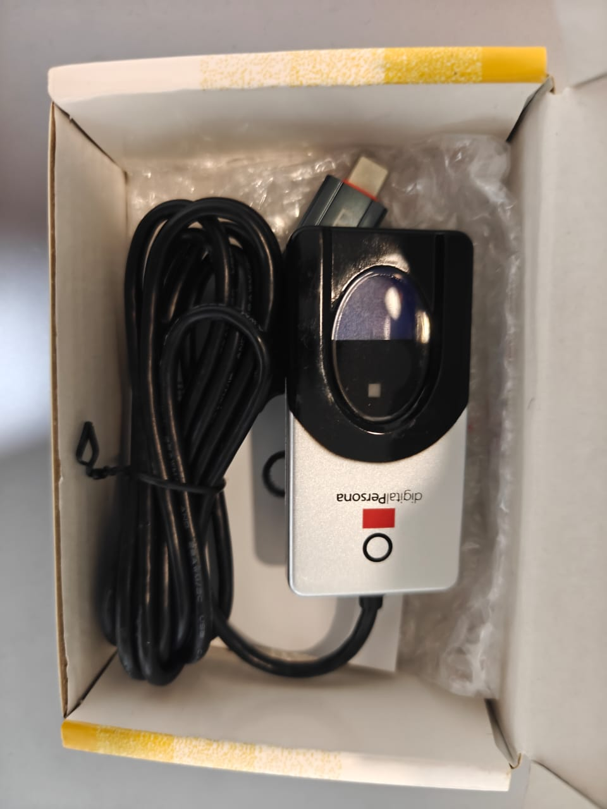

# Biometric Authentication — Flutter Plugin (DigitalPersona U.are.U 4500)

> A **Flutter plugin** that integrates a **DigitalPersona U.are.U 4500 (U4500B) USB fingerprint reader** with Android apps — captures fingerprint images directly over the Android USB host stack, converts them to interoperable **ANSI/ISO fingerprint templates** via the SourceAFIS engine, and exposes a **1:1 template-match score** API for enrollment + verification. Drops into any Flutter app that needs hardware-backed fingerprint identification on a tablet or terminal (attendance kiosks, field workforce, payroll sign-on, etc.).

---

## Table of Contents

1. [Business Problem Solved](#1-business-problem-solved)
2. [Stack](#2-stack)
3. [Architecture Overview](#3-architecture-overview)
4. [Repository Structure](#4-repository-structure)
5. [Screenshots](#5-screenshots)
6. [Deployment Approach](#6-deployment-approach)
7. [Notes & Status](#7-notes--status)

---

## 1. Business Problem Solved

Android's built-in `BiometricPrompt` / `local_auth` flow only authenticates against the **device's own sensor** — the user that's enrolled on that phone. That's useless for the real-world use case this plugin solves:

> *Identify any one of N enrolled workers, on a shared tablet, against a known reference template — using a high-quality external optical scanner you can place on a desk.*

For palm-oil estate ops (the originating use case in the broader IRGA ecosystem), the scenario is:

- A **shared Android tablet** at the muster point.
- A **DigitalPersona U.are.U 4500B** USB scanner connected over OTG.
- Several hundred **gang laborers** with previously enrolled fingerprint templates stored in the backend.
- A field supervisor needs to **identify the right worker** before logging attendance, harvesting, or work-order output — without the worker needing to own a phone, register a face, or remember an ID.

Off-the-shelf Flutter biometric packages don't cover this — they assume the platform sensor + the platform's own template store. This plugin fills the gap by:

- **Talking to the U4500B directly** over Android USB host (vendor `0x05BA`, product `0x000A`) — no vendor SDK lock-in.
- **Returning a portable template** (SourceAFIS — ANSI/ISO compatible) you can store on any backend and re-match anywhere.
- **Doing 1:1 comparison locally** between any two Base64-encoded templates, returning a numeric similarity score so the calling app can pick its own threshold.

What you can build on top of it:

- **Attendance / muster** sign-on against a roster of enrolled workers.
- **Worker enrollment** flows (capture once, store template per employee).
- **Sensitive-action confirmation** (e.g. payroll approval) gated on fingerprint match.
- **Offline-capable identification** — the template + match runs entirely on-device; no network needed for the match itself.

The result: any Flutter app on Android can plug in a USB U4500B and get production-quality fingerprint capture + matching, with templates that round-trip cleanly to and from any storage layer (Postgres, Convex, an HRMS, an estate-admin backend).

---

## 2. Stack

### Dart / Flutter side
| Layer | Choice |
| --- | --- |
| Framework | **Flutter ≥ 2.5.0** (Dart SDK `>=2.19.5 <3.0.0`) |
| Plugin contract | **`plugin_platform_interface` 2.0.2** (federated plugin pattern) |
| Permissions | **`permission_handler` 10.x** |
| Fallback biometrics | **`local_auth`** (for the platform's own sensor where appropriate) |
| Transport | `MethodChannel('flutter_fingerprint_plugin_v2')` |

### Android native side
| Layer | Choice |
| --- | --- |
| Languages | **Kotlin 1.7.10** (plugin entry) + **Java** (USB stack) |
| Build | **Android Gradle Plugin 7.2.0**, Java 1.8, `multiDexEnabled` |
| SDKs | `compileSdk` 31 · `targetSdk` 31 · `minSdk` 16 |
| Fingerprint engine | **SourceAFIS 3.10.0** (open-source ANSI/ISO matcher) |
| USB I/O | Android `UsbManager` + `UsbDeviceConnection` + `UsbRequest` |
| AndroidX | `core:1.7.0`, `appcompat-v7:31.0.0`, `multidex:2.0.1` |
| Aux | `it.unimi.dsi:fastutil:7.2.0`, `desugar_jdk_libs:1.1.5` |

### Hardware
| Item | Value |
| --- | --- |
| Reader | **DigitalPersona U.are.U 4500B** (USB) |
| Vendor ID | `0x05BA` (1466) |
| Product ID | `0x000A` (10) |
| Connection | USB host (OTG) on the Android device |
| Image format | Raw bitmap from the reader, 16 384 bytes per frame |
| IRQ stream | 64-byte interrupt packets carrying scanner status codes |

---

## 3. Architecture Overview

### High-level

```
                ┌─────────────────────────────────────────────────────────┐
                │              Host Flutter app (Dart)                    │
                │                                                         │
                │   final fp = FlutterFingerprintPluginV2();              │
                │                                                         │
                │   await fp.isDeviceConnected();   // true / false       │
                │   final tpl = await fp.scanFingerprint();   // Base64   │
                │   await fp.stopFingerprint();                           │
                │   final score = await fp.compareTemplate(t1, t2);      │
                └────────────────────────────┬────────────────────────────┘
                                             │
                            MethodChannel('flutter_fingerprint_plugin_v2')
                                             │
                                             ▼
                ┌─────────────────────────────────────────────────────────┐
                │  Android — FlutterFingerprintPluginV2Plugin.kt          │
                │                                                         │
                │  onMethodCall:                                          │
                │    • getPlatformVersion → Build.VERSION.RELEASE         │
                │    • isDeviceConnected  → scan UsbManager deviceList    │
                │                            for VID 1466 / PID 10        │
                │    • scanFingerprint    → request USB permission        │
                │                            → Fingerprint.scan(…)        │
                │                            → printHandler() on main loop│
                │                            → SourceAFIS template        │
                │                            → Base64 string back to Dart │
                │    • stopFingerprint    → Fingerprint.turnOffReader()   │
                │    • compareTemplate    → SourceAFIS                    │
                │                            FingerprintMatcher.match()   │
                └────────────────────────────┬────────────────────────────┘
                                             │
       ┌─────────────────────────────────────┼─────────────────────────────────┐
       │                                     │                                 │
       ▼                                     ▼                                 ▼
┌────────────────┐                  ┌────────────────────┐          ┌────────────────────┐
│ Fingerprint.   │  USB control /   │ ScanFinger         │  USB IRQ │ SourceAFIS         │
│ java           │  bulk endpoints  │ (Runnable, BG      │  + image │ FingerprintTemplate│
│                │                  │  thread)           │   frames │ FingerprintMatcher │
│ • registers    │                  │ • opens USB        │          │ • create(image)    │
│   USB BroadcastReceiver           │   endpoints        │          │ • toByteArray()    │
│ • requests USB permission          │ • watches IRQ     │          │ • match → score    │
│   via PendingIntent                │   codes:          │          └────────────────────┘
│ • posts image / status onto        │   SCANPWR_ON     │
│   Handler(Looper.getMainLooper())  │   FINGER_ON      │
│                                    │   FINGER_OFF     │
│                                    │   DEATH          │
│                                    │ • reads 16 384-B │
│                                    │   image frames   │
│                                    │ • posts Bundle   │
│                                    │   {status,img}   │
│                                    │   to mainHandler │
└────────────────┘                  └────────────────────┘
       │                                     │
       └─────────────────────────────────────┘
                            │
                            ▼
                ┌─────────────────────────────────────────┐
                │   USB host — DigitalPersona U4500B      │
                │   VID 0x05BA · PID 0x000A               │
                └─────────────────────────────────────────┘
```

### Federated plugin layout (Dart side)

```
FlutterFingerprintPluginV2                ← public API the app calls
        │
        ▼
FlutterFingerprintPluginV2Platform        ← abstract platform interface
   (PlatformInterface + verifyToken)
        │
        ▼
MethodChannelFlutterFingerprintPluginV2    ← default implementation
   const MethodChannel('flutter_fingerprint_plugin_v2')
```

Standard federated-plugin pattern from the official Flutter team, so an iOS implementation (or a different Android sensor) can be slotted in by subclassing `FlutterFingerprintPluginV2Platform` without breaking the public API.

### Native scanner state machine

`Status.java` defines a tight enum that flows from `ScanFinger` → status `Handler` so the calling app can show progress:

| Code | Meaning |
| ---: | --- |
| `-1` | `ERROR` |
| `0`  | `SUCCESS` (image captured) |
| `1`  | `INITIALISED` |
| `2`  | `READY_TO_SCAN` |
| `3`  | `FINGER_DETECTED` |
| `4`  | `RECEIVING_IMAGE` |
| `5`  | `SCANNER_POWERED_ON` |
| `6`  | `FINGER_LIFTED` |
| `7`  | `SCANNER_POWERED_OFF` |

The corresponding USB IRQ codes from the reader hardware:

| IRQ word | Meaning |
| --- | --- |
| `0x56AA` | Scan power on |
| `0x0101` | Finger on platen |
| `0x0200` | Finger off platen |
| `0x0800` | Reader "death" / disconnect |

### Capture flow (one `scanFingerprint()` call)

```
Dart: fp.scanFingerprint()
   │
   ▼
Plugin.kt: checks USE_FINGERPRINT permission → requests if missing
   │
   ▼
Fingerprint.scan(context, imageHandler, statusHandler)
   │
   ├─ UsbManager.requestPermission(device, PendingIntent → ACTION_USB_PERMISSION)
   ├─ on permission grant: open UsbDeviceConnection, claim interface
   ├─ spin ScanFinger Runnable on BG thread
   │     loop:
   │        read 64-byte IRQ packet
   │        on FINGER_ON: read 16 384-byte image frame
   │                       sendImage(img) → imageHandler.sendMessage(...)
   │        on FINGER_OFF / DEATH: break
   │
   ▼
printHandler (main loop):
   image bytes  → SourceAFIS FingerprintTemplate().create(image)
                → template.toByteArray()
                → Base64.encodeToString(...)
                → result.success(base64Template)   ← returned to Dart
```

### Match flow (`compareTemplate(t1, t2)`)

```
Dart: fp.compareTemplate(b64A, b64B) → double score
                │
                ▼
Plugin.kt:
   FingerprintTemplate(Base64.decode(b64A))
   FingerprintTemplate(Base64.decode(b64B))
   matcher = FingerprintMatcher()
   matcher.index(tplA)
   score = matcher.match(tplB)
   result.success(score)
```

The score is the SourceAFIS similarity number; the calling app picks its own accept threshold (SourceAFIS defaults to ~40 for ≈ 0.01% FMR, tunable per deployment).

### Android permissions & features

Declared in `android/src/main/AndroidManifest.xml`:

| Permission / feature | Why |
| --- | --- |
| `android.permission.USB_PERMISSION` | runtime grant for the U4500B device |
| `<uses-feature android.hardware.usb.host required="true" />` | OTG capability |
| `android.permission.USE_FINGERPRINT` | legacy biometric (≤ API 28) |
| `android.permission.USE_BIOMETRIC` | modern biometric API |
| `<uses-feature android.hardware.fingerprint />` | discovery filter |
| `<uses-feature android.hardware.biometrics />` | discovery filter |
| `android.permission.ACCESS_FINE_LOCATION` | required for some OEM USB / Bluetooth peripheral flows |

---

## 4. Repository Structure

```
irga_fingerprint_plugin-main/
├── pubspec.yaml                          # plugin manifest (federated Android plugin)
├── analysis_options.yaml
├── LICENSE  CHANGELOG.md  README.md
│
├── lib/                                  # Dart side (3 files)
│   ├── flutter_fingerprint_plugin_v2.dart                  # public API
│   ├── flutter_fingerprint_plugin_v2_platform_interface.dart   # abstract interface
│   └── flutter_fingerprint_plugin_v2_method_channel.dart   # default MethodChannel impl
│
├── android/
│   ├── build.gradle                      # SourceAFIS 3.10.0, AndroidX, multidex
│   ├── proguard-rules.pro
│   ├── settings.gradle
│   ├── gradle/wrapper/
│   ├── app/src/main/assets/version.txt
│   └── src/main/
│       ├── AndroidManifest.xml           # USB + biometric permissions / features
│       ├── resources/version.txt
│       └── kotlin/com/example/flutter_fingerprint_plugin_v2/
│           ├── FlutterFingerprintPluginV2Plugin.kt   # plugin entry + MethodChannel router
│           ├── Fingerprint.java                       # device lifecycle, USB perm, handlers
│           ├── ScanFinger.java                        # background USB IRQ + image read loop
│           ├── UruConnection.java                     # low-level Uru/U.are.U USB protocol
│           ├── UruImage.java                          # raw frame → bitmap / PGM
│           ├── Status.java                            # status code enum
│           └── sourceAFIS.java                        # SourceAFIS bridge helpers
│
├── example/                              # Flutter example app
│   ├── pubspec.yaml
│   ├── lib/main.dart                     # demonstrates connect / scan x2 / compare
│   ├── android/
│   ├── output_dir/
│   └── test/
│
└── test/                                 # plugin unit tests
```

### Surface-area counts

- **Dart files:** 3 (`public API` · `platform interface` · `method channel`)
- **Android native files:** 7 (`1 Kotlin` + `6 Java`)
- **Public Dart methods:** 5 (`getPlatformVersion`, `isDeviceConnected`, `scanFingerprint`, `stopFingerprint`, `compareTemplate`)
- **MethodChannel methods handled:** 7 (incl. legacy `compareTemplate2` and async events `onFingerprintScanned` / `onFingerprintScanError`)
- **Scanner status codes:** 9 (`-1` … `7`)
- **USB IRQ codes handled:** 4

---

## 5. Screenshots

<!-- ### Example app — hardware + capture demo




### USB permission flow


### Capture


### Enroll + verify


### Integration screenshots (host apps using the plugin)

 -->


## 6. Deployment Approach

This is a **Flutter plugin**, not an app — "deployment" means consuming it from a host Flutter app that targets Android. Two delivery modes are supported.

### A. Local / path dependency (recommended during development)

Drop the plugin folder next to your host app and reference it by path in `pubspec.yaml`:

```yaml
dependencies:
  flutter_fingerprint_plugin_v2:
    path: ../irga_fingerprint_plugin-main
```

Then:

```bash
flutter pub get
flutter run -d <android-device-id>
```

This is exactly how the bundled `example/` app consumes the plugin.

### B. Git dependency (recommended for teams)

```yaml
dependencies:
  flutter_fingerprint_plugin_v2:
    git:
      url: git@github.com:<org>/irga_fingerprint_plugin.git
      ref: main
```

Pinned to a tag or commit for reproducible builds.

### Host-app prerequisites

1. **`minSdkVersion ≥ 16`** in the host app's `android/app/build.gradle` (the plugin sets 16 as its floor).
2. **`multiDexEnabled true`** if the host app already crosses the 64K method limit.
3. **`<uses-feature android.hardware.usb.host required="true" />`** in the host `AndroidManifest.xml` (alongside the biometric features the plugin already declares).
4. Request USB permission at runtime — the plugin does this via a `PendingIntent` broadcast; the host just needs to be in the foreground when the prompt fires.
5. Ship the host app on a device with **USB host (OTG)** support and a powered USB hub if the U4500B needs more current than the tablet's port provides.

### Minimal integration

```dart
import 'package:flutter_fingerprint_plugin_v2/flutter_fingerprint_plugin_v2.dart';

final fp = FlutterFingerprintPluginV2();

// 1. Confirm the U4500B is plugged in
final isConnected = await fp.isDeviceConnected();

// 2. Enroll — capture once, persist the Base64 template on your backend
final enrolledTemplate = await fp.scanFingerprint();    // String (Base64)

// 3. Verify — capture a fresh sample, compare against the stored template
final liveTemplate = await fp.scanFingerprint();
final score = await fp.compareTemplate(enrolledTemplate, liveTemplate);

// 4. App decides the accept threshold (SourceAFIS default ~ 40 → ~0.01% FMR)
if (score >= 40) { /* accept */ } else { /* reject */ }
```

### Backend persistence pattern

Templates are **opaque Base64 strings** (ANSI/ISO-compatible SourceAFIS output). Round-trip cleanly through:

- **Postgres / MSSQL** — a single `TEXT` / `NVARCHAR(MAX)` column per enrolled finger.
- **Convex / Firestore / DynamoDB** — a string field on the worker / employee document.
- **HRMS attendance records** — store the enrollment template once on the employee record; the per-event match score can be logged for audit.

Matching can happen client-side (`compareTemplate(t1, t2)` on the tablet, scaling to ~ N templates per worker) or be pushed server-side later by porting the matcher (SourceAFIS is JVM; equivalent ports exist for other runtimes).

### Production checklist

- **USB power.** The U4500B is bus-powered; some Android tablets struggle to deliver enough current through OTG. Use a Y-cable or a powered hub for kiosk deployments.
- **Threshold tuning.** Pilot on the target user population — humidity, finger condition, and placement habit shift the score distribution. Start at SourceAFIS's recommended ~40 and adjust against measured FMR/FNMR.
- **Threading.** Capture and match are off-main-thread on the native side. The Dart side `await`s a single `String` / `double`; no isolate plumbing needed in the host app.
- **Permissions UX.** The host should explain *before* the OS prompt fires why USB + biometric permission is needed (Material guidelines).
- **No background capture.** Kotlin layer requires the activity to be in the foreground to receive the USB permission broadcast — design enrollment / verify flows as foreground modals.
- **Privacy.** Templates are non-reversible (you can't reconstruct the image), but treat them as PII — encrypt at rest and in transit on your backend.

### CI / release

- **Lint + analyze:** `flutter analyze` against `lib/` and `example/lib/`.
- **Unit test:** `flutter test` against `test/`.
- **Example build:** `cd example && flutter build apk` to catch host-side integration breakage.
- **Publishing:** internal — keep on private git; `pubspec.yaml` does **not** set `publish_to`, so a `flutter pub publish` is intentionally not the default path.

---

## 7. Notes & Status

- **Hardware-specific.** This is not a generic Android biometric wrapper — it talks to the **DigitalPersona U.are.U 4500B (VID `0x05BA`, PID `0x000A`)** over USB host. To add another scanner, fork `Fingerprint.java` / `ScanFinger.java` / `UruConnection.java` and adjust the IRQ codes + image frame size for the new device; the SourceAFIS template path is hardware-agnostic so the Dart-side API stays identical.
- **Federated plugin pattern.** The `PlatformInterface` + `MethodChannel` split means an iOS implementation (or a different Android sensor) can be added by subclassing `FlutterFingerprintPluginV2Platform` — the host app's calls don't change.
- **Templates are portable.** SourceAFIS produces ANSI/ISO-compatible templates; matching can happen on the device today and move server-side later without re-enrolling users.
- **Local + non-vendor.** Capture and match run entirely on-device; no DigitalPersona SDK, no cloud round-trip, no per-device license. The only runtime dependency is the USB connection to the reader.
- **Built for the IRGA palm-oil ecosystem.** Originally drives worker identification at muster points on shared tablets, but the API surface is generic — any Flutter app needing 1:1 fingerprint match on Android can drop it in.
- **Roadmap.** iOS support (would require a different sensor and a separate `…_ios.dart` package); a higher-level Dart helper that bundles capture + threshold + result into a single Future; example-app polish (currently a working-but-bare scaffold for demonstrating the API).

---

*Portfolio doc — last updated 2026-05-28.*
